# AEGIS

<div align="center">


## AI-Powered Emergency Response Command Center

AEGIS is an intelligent emergency operations platform for dispatch, routing, patient triage, and decision support in real time.

<p>
  <a href="#overview">Overview</a> |
  <a href="#product-preview">Preview</a> |
  <a href="#key-capabilities">Capabilities</a> |
  <a href="#architecture">Architecture</a> |
  <a href="#quick-start">Quick Start</a> |
  <a href="#environment-variables">Environment</a>
</p>

<p>
  
  
  
  
  
  
  
</p>

<p>
  <a href="frontend/src/assets/pitch/Generaci%C3%B3n_de_Video_de_Introducci%C3%B3n_IA.mp4">Watch Product Demo</a>
</p>

<p>
  <a href="frontend/src/assets/pitch/AEGIS_Mission_Control.pdf">
    
  </a>
</p>

<p>
  <strong>Featured Document:</strong> Mission Control executive brief with architecture, product narrative, and demo storyline.
</p>

</div>

## Product Preview

<div align="center">
  
</div>

## Product Gallery

### 1) Real-Time Operations Map

<div align="center">
  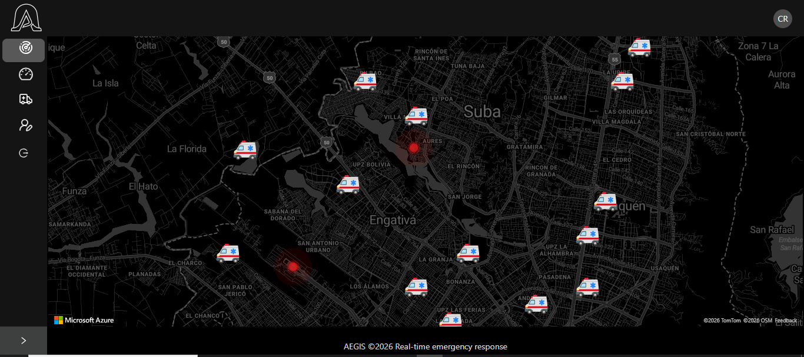
</div>

This is the main operations surface. Built on Azure Maps, it renders incidents and ambulances in real time and opens the Incident Centric View when a case is selected.

What it does in practice:

- Loads incidents through `useIncidents` and ambulances through `useAmbulances`.
- Renders incident and unit markers using dedicated map hooks.
- Connects incident selection to the operational analytics and decision drawer.

### 2) AI Decision Center

<div align="center">
  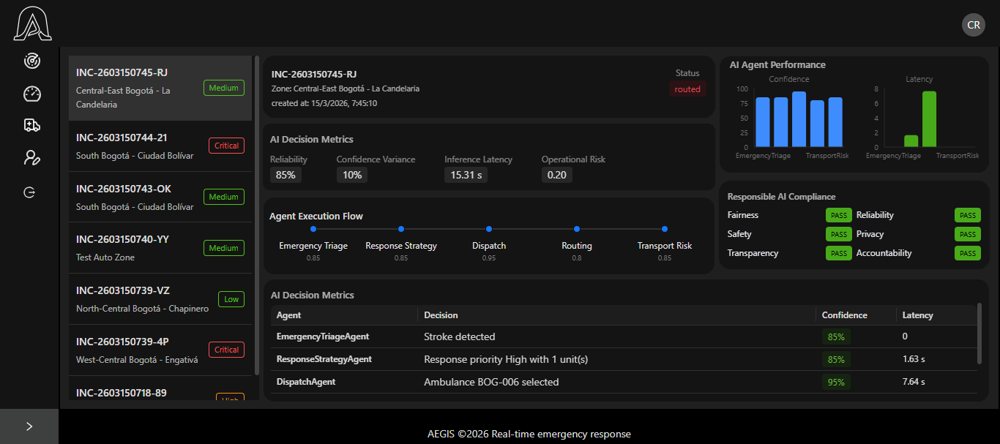
</div>

This module centralizes AI decision supervision for each incident. It combines a case sidebar with reliability KPIs, total latency, operational risk, and full agent execution pipeline visibility.

Key highlights:

- Incident sidebar to switch context without leaving the dashboard.
- Decision quality cards (reliability, confidence variance, latency).
- Governance panel and end-to-end agent decision pipeline.

### 3) Incident Centric View - AI Route Intelligence (Analytics)

<div align="center">
  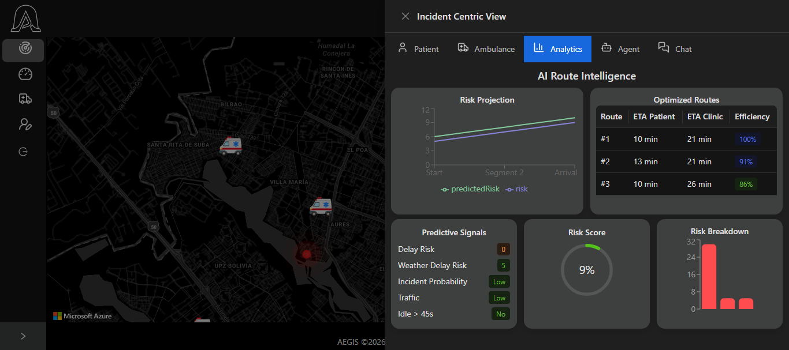
</div>

This panel presents route intelligence for dispatch: risk projection, optimized route ranking, risk score, and a factor-by-factor explanation of what is impacting response performance.

It includes:

- Risk Projection with trend and segment-level prediction.
- Optimized Routes comparing ETA to patient and clinic.
- Predictive Signals for traffic, delays, and operational probability.
- Bar-based Risk Breakdown explaining why one route is riskier than another.

### 4) Incident Centric View - Agent Trace

<div align="center">
  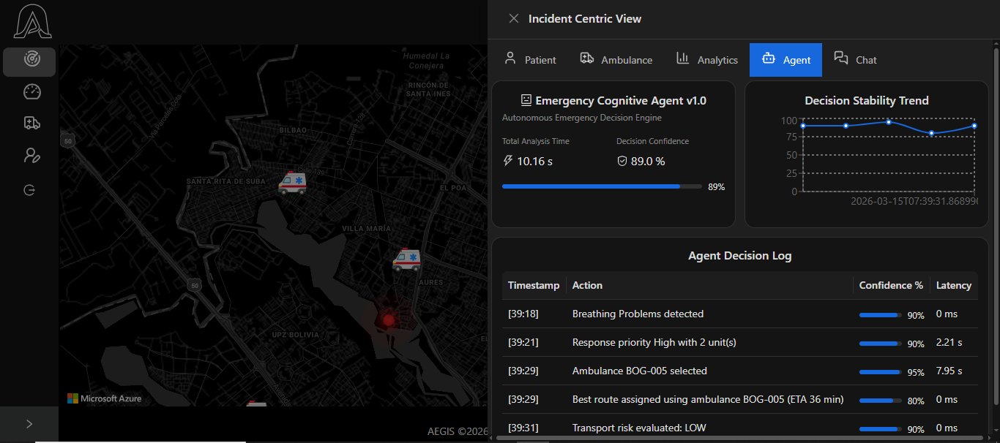
</div>

This screen turns agent behavior into auditable traces: total analysis time, decision confidence, temporal stability, and step-by-step action logs with latency.

Operational value:

- Makes it easier to explain why a decision was made.
- Helps detect quality degradation caused by latency or low confidence.
- Supports technical auditability and continuous multi-agent optimization.

### 5) Incident Centric View - Ambulance Intelligence

<div align="center">
  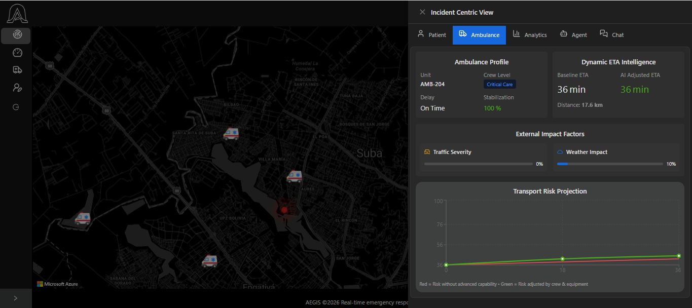
</div>

This panel combines unit profile, dynamic ETA, external impact factors, and transport risk projection to support safer and more effective ambulance allocation.

Key elements:

- Baseline ETA vs AI Adjusted ETA to quantify context impact.
- Traffic Severity and Weather Impact with visual indicators.
- Transport Risk Projection comparing baseline vs adjusted scenario.

### 6) Incident Centric View - Patient Clinical Context

<div align="center">
  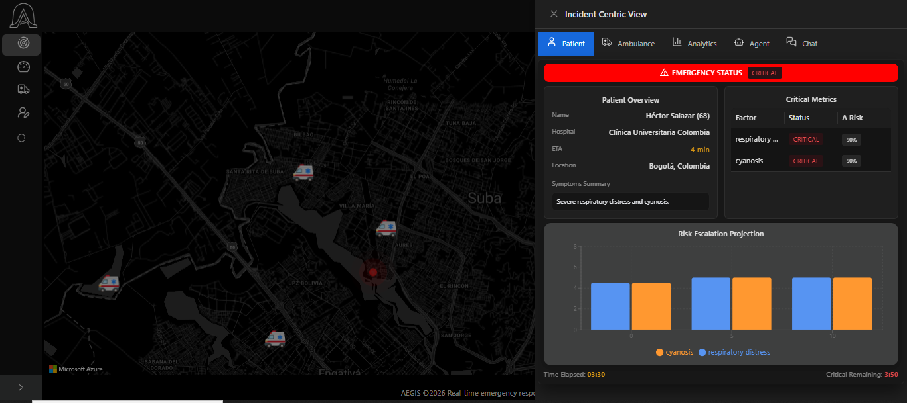
</div>

This module presents patient clinical context in an actionable way: severity level, patient details, critical metrics, and AI-driven risk escalation projection.

What it provides:

- Emergency state and severity in the header.
- Tabular Critical Metrics with status and risk delta.
- AI Risk Escalation Projection to anticipate deterioration by factor.

### 7) Incident Centric View - Operational Chat

<div align="center">
  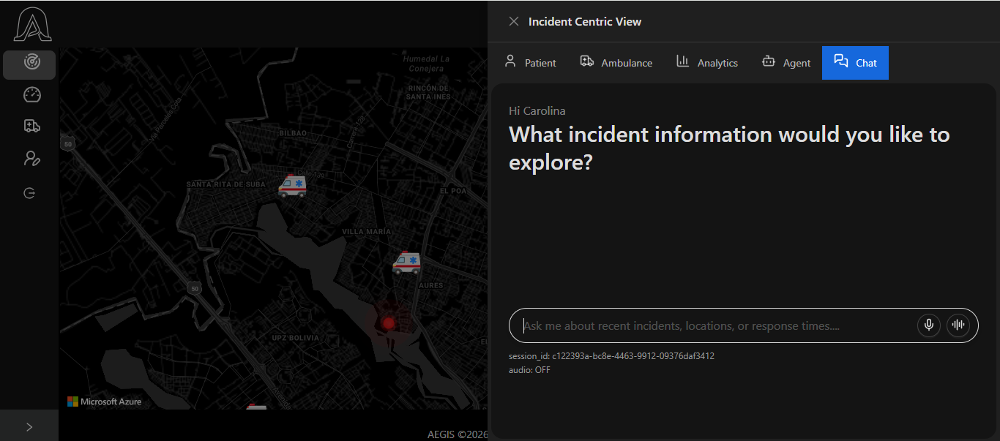
</div>

The operational chat enables assisted incident exploration with both text and voice input, and can return evidence files or supporting artifacts for operators.

Visible capabilities:

- Session-based contextual conversation for continuous follow-up.
- Real-time audio mode for hands-free interaction.
- Responses with selectable options and downloadable support files.

### 8) WhatsApp Intake - Emergency Report

<div align="center">
  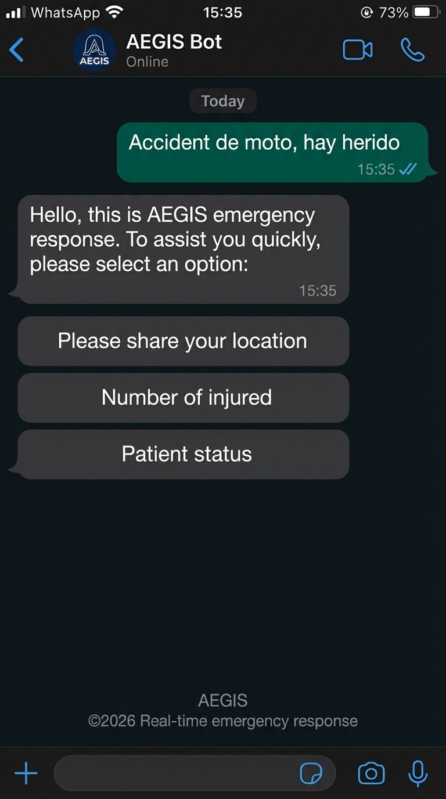
</div>

This first touchpoint enables zero-friction incident reporting through WhatsApp. Citizens can report the emergency immediately without installing an app.

Flow highlights:

- Guided intake messages for emergency type and key details.
- Fast location capture request to anchor the incident on the map.
- Structured handoff-ready payload for AEGIS triage and routing.

### 9) WhatsApp Intake - Case Confirmation and ETA

<div align="center">
  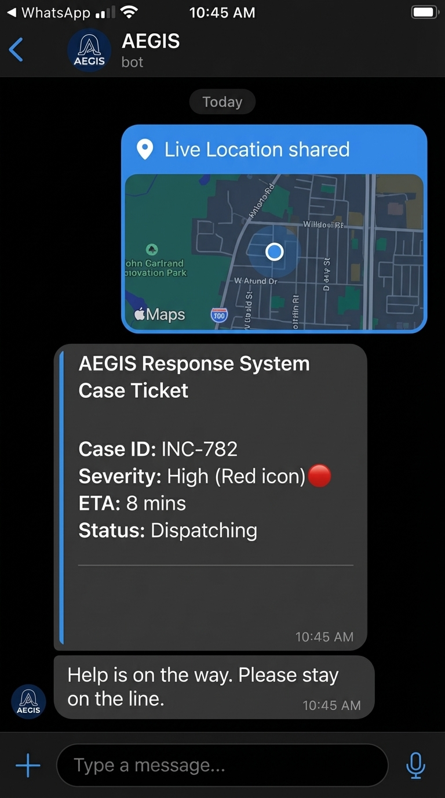
</div>

After intake validation, the user receives case confirmation, case identifier, and an initial ETA estimate so they know the request is actively being processed.

What this step provides:

- Immediate case acknowledgment.
- Human-readable case ID for traceability.
- Early ETA visibility while orchestration continues in AEGIS.

### 10) WhatsApp Intake - Real-Time Status Updates

<div align="center">
  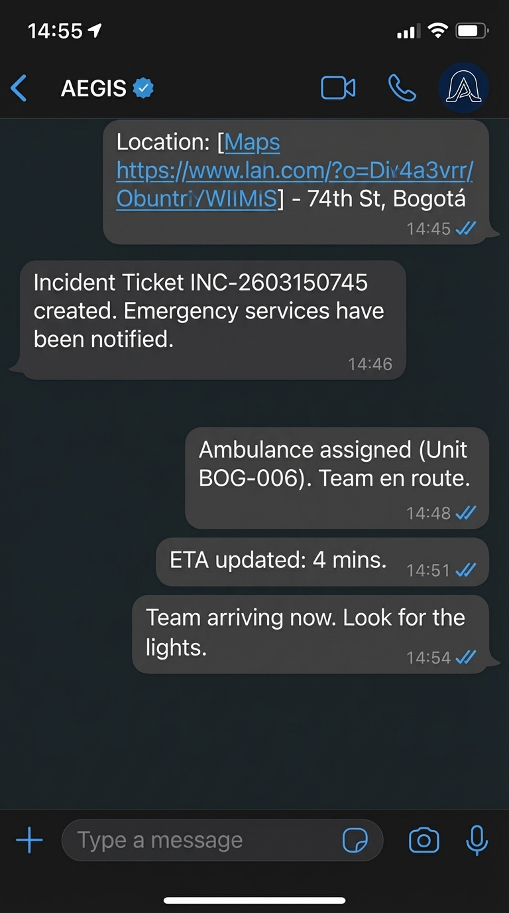
</div>

The final stage keeps the citizen informed with automatic progress updates from dispatch to arrival, aligned with command-center decisions.

Operational value:

- Reduces uncertainty during critical incidents.
- Mirrors AEGIS dispatch status in a familiar channel.
- Extends command-center transparency to end users.

## Overview

AEGIS is a real-time emergency response platform built to support high-pressure operational environments. It combines live geospatial monitoring, ambulance coordination, AI-assisted medical triage, routing intelligence, and decision traceability inside a single command-center experience.

Instead of acting like a simple CRUD system, AEGIS is designed as an operational intelligence layer for emergency dispatch. It brings together field resources, incidents, clinics, insurance constraints, route conditions, and agent reasoning so teams can respond faster and with more context.

## Why It Stands Out

| Area | What AEGIS delivers |
| --- | --- |
| Real-time command center | Interactive map-based operations with incidents and ambulances on the same surface. |
| Incident-centric workflow | A focused operational drawer that consolidates patient, transport, analytics, AI traces, and chat. |
| Multi-agent intelligence | Separate agents handle triage, dispatch selection, response strategy, and transport risk. |
| Explainability | Decisions include reasoning, confidence scoring, and trace persistence for review and audit. |
| Cloud-native integrations | Azure Maps, Azure AI Search, Azure AD, OpenAI, and Dockerized deployment. |
| Demo-ready architecture | Strong fit for health tech, smart city, command center, and applied AI presentations. |

## Key Capabilities

<table>
  <tr>
    <td width="33%">
      <strong>Geospatial Operations</strong><br/>
      Live incident and ambulance visualization using Azure Maps with operational context layered directly onto the map.
    </td>
    <td width="33%">
      <strong>AI Decision Support</strong><br/>
      Triage, dispatch, strategy, and transport risk are modeled as distinct intelligent agents with structured outputs.
    </td>
    <td width="33%">
      <strong>Operational Traceability</strong><br/>
      Decision traces, analytics, and confidence values make the system suitable for demos, reviews, and audits.
    </td>
  </tr>
</table>

## Experience Surface

### Frontend Experience

- Live map interface for operational monitoring.
- Incident Centric View with patient, ambulance, analytics, agent insights, and chat.
- Dedicated modules for agents, patients, and ambulances.
- Azure AD authentication with MSAL.
- Multi-language setup with English, Spanish, French, and Japanese.

Current routes discovered in the application:

| Route | Purpose |
| --- | --- |
| `/` | Main operational map |
| `/map` | Azure Maps emergency response view |
| `/agents` | AI agent dashboard and decision modules |
| `/patients` | Patient management and overview |
| `/ambulances` | Ambulance operations panel |

### Backend Services

- FastAPI application versioned under `/api/v1`.
- Dynamic database target: local MongoDB or Azure Cosmos DB Mongo API.
- Database bootstrap at startup, including initialization tasks.
- Repository layer for incidents, ambulances, clinics, providers, patients, insurance, supervisors, and zones.
- Service layer for orchestration, routing, observability, health metrics, and decision traces.

Visible endpoint groups from the main API entrypoint:

| Endpoint or group | Purpose |
| --- | --- |
| `GET /api/v1/health` | Operational health status, optionally filtered by zone. |
| `POST /api/v1/incident` | Dispatch calculation based on patient location, ambulances, and clinics. |
| `GET /api/v1/decisions/{incident_id}/traces` | Retrieves the AI decision trace for a specific incident. |
| incidents, zones, supervisors, insurance, clinics, ambulances, providers, patients, dispatch | Domain APIs exposed through dedicated routers. |

## AI Layer

| Component | Responsibility |
| --- | --- |
| `TriageAgent` | Classifies incident type, criticality level, confidence, and critical metrics. |
| `DispatchAgent` | Chooses the best ambulance and clinic for the case. |
| `ResponseStrategyAgent` | Recommends response priority, dispatch mode, and units. |
| `TransportRiskAgent` | Evaluates transport safety using route, weather, and traffic context. |
| `RAGService` | Injects retrieved context from Azure AI Search into decision flows. |
| `Semantic Kernel` | Runs prompt-based orchestration against the configured OpenAI model. |

## Architecture

### Visual Diagram (Eraser Export)

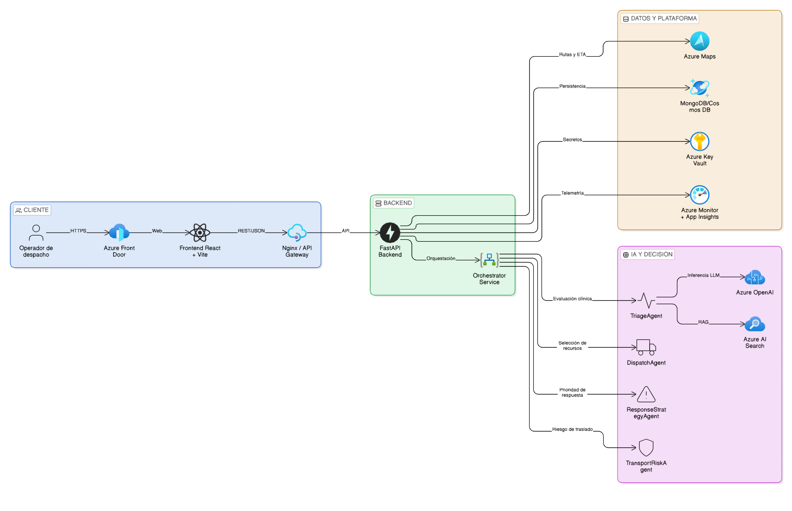

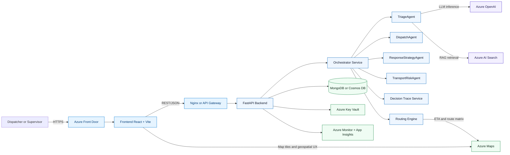

## Intelligent Flow

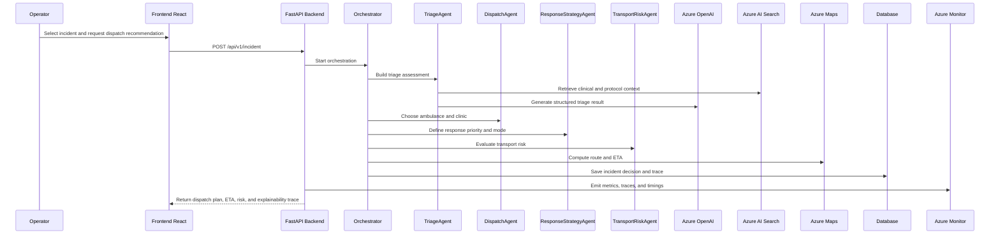

## Deployment View

### Eraser Source Diagrams

- [docs/architecture/aegis-deployment-architecture.eraser](docs/architecture/aegis-deployment-architecture.eraser)
- [docs/architecture/aegis-intelligent-flow.eraser](docs/architecture/aegis-intelligent-flow.eraser)
- [docs/architecture/aegis-data-integrations.eraser](docs/architecture/aegis-data-integrations.eraser)
- [docs/architecture/aegis-security-observability.eraser](docs/architecture/aegis-security-observability.eraser)

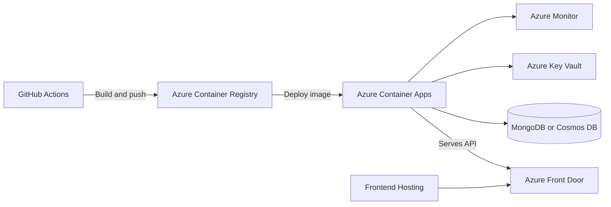

## Tech Stack

| Layer | Technologies |
| --- | --- |
| Frontend | React 18, TypeScript, Vite, Ant Design, TailwindCSS, React Query, Azure Maps, MSAL, i18next |
| Backend | FastAPI, Uvicorn, Motor, Pydantic v2, python-dotenv |
| AI | Semantic Kernel, OpenAI Chat Completion, Azure AI Search, RAG |
| Data | MongoDB local or Azure Cosmos DB with Mongo compatibility |
| Infra | Docker, Docker Compose, Nginx |

## Repository Layout

```text
aegis-project/
|- backend/
|  |- app/
|  |  |- agents/
|  |  |- ai/
|  |  |- api/v1/
|  |  |- core/
|  |  |- models/
|  |  |- repositories/
|  |  |- schemas/
|  |  |- services/
|  |  `- main.py
|  `- requirements.txt
|- frontend/
|  |- public/
|  |- src/
|  |  |- assets/
|  |  |- auth/
|  |  |- components/
|  |  |- config/
|  |  |- hooks/
|  |  |- i18n/
|  |  |- providers/
|  |  `- routes/
|  `- package.json
|- backend.Dockerfile
|- frontend.Dockerfile
|- docker-compose.yml
`- nginx.conf
```

## Quick Start

### Requirements

- Docker and Docker Compose.
- Python 3.12 for local backend execution.
- Node.js 20 for local frontend execution.
- Valid Azure and OpenAI credentials for full AI functionality.

### Run with Docker Compose

1. Create a root `.env` file.
2. Populate infrastructure, backend, and frontend variables.
3. Start the stack:

```bash
docker compose up --build
```

Expected services:

| Service | Container port | Exposed port |
| --- | --- | --- |
| Backend | `8000` | `${BACKEND_PORT}` |
| Frontend | `80` | `${FRONTEND_PORT}` |

### Run Locally

Backend:

```bash
cd backend
pip install -r requirements.txt
uvicorn app.main:app --reload --host 0.0.0.0 --port 8000
```

Frontend:

```bash
cd frontend
npm install
npm run dev
```

## Environment Variables

There is currently no official `.env.example` file in the repository. The following variables were identified directly from the application code and Docker configuration.

### Backend

| Variable | Purpose |
| --- | --- |
| `ENVIRONMENT` | Selects `local`, `development`, or `production`. |
| `CORS_ORIGINS` | Comma-separated list of allowed origins. |
| `MONGO_URI` | Local MongoDB connection string. |
| `MONGO_URI_AZURE` | Azure Cosmos DB Mongo-compatible connection string. |
| `DATABASE_NAME` | Database name. |
| `AZURE_OPENAI_ENDPOINT` | Azure OpenAI endpoint if used in the target environment. |
| `AZURE_OPENAI_KEY` | Azure OpenAI credential. |
| `AZURE_MONITOR_CONNECTION_STRING` | Telemetry and monitoring configuration. |
| `AZURE_MAPS_KEY` | Maps and routing credential. |
| `AZURE_MAPS_URL` | Azure Maps base URL. |
| `AZURE_SEARCH_ENDPOINT` | Azure AI Search endpoint. |
| `AZURE_SEARCH_INDEX` | Search index used by RAG. |
| `AZURE_SEARCH_KEY` | Azure AI Search credential. |
| `OPENAI_API_KEY` | OpenAI API key. |
| `OPENAI_MODEL` | Model name used by Semantic Kernel. |

### Frontend

| Variable | Purpose |
| --- | --- |
| `VITE_API_URL` | Backend base URL. Example: `http://localhost:8000/api/v1`. |
| `VITE_AZURE_MAPS_KEY` | Browser-side Azure Maps key. |
| `VITE_AZURE_CLIENT_ID` | Azure AD application client ID. |
| `VITE_AZURE_TENANT_ID` | Azure AD tenant ID. |
| `VITE_APP_URL` | App URL used by MSAL logout and redirects. |

### Infrastructure

| Variable | Purpose |
| --- | --- |
| `BACKEND_PORT` | Public backend port in Docker Compose. |
| `FRONTEND_PORT` | Public frontend port in Docker Compose. |

### Minimal Template

```env
ENVIRONMENT=local
CORS_ORIGINS=http://localhost:5173,http://localhost:3000
MONGO_URI=mongodb://localhost:27017
MONGO_URI_AZURE=<azure-cosmos-mongo-uri>
DATABASE_NAME=aegis_db

AZURE_OPENAI_ENDPOINT=<your-endpoint>
AZURE_OPENAI_KEY=<your-key>
AZURE_MONITOR_CONNECTION_STRING=<your-monitor-connection-string>
AZURE_MAPS_KEY=<your-azure-maps-key>
AZURE_MAPS_URL=https://atlas.microsoft.com
AZURE_SEARCH_ENDPOINT=<your-search-endpoint>
AZURE_SEARCH_INDEX=<your-search-index>
AZURE_SEARCH_KEY=<your-search-key>

OPENAI_API_KEY=<your-openai-key>
OPENAI_MODEL=<your-openai-model>

VITE_API_URL=http://localhost:8000/api/v1
VITE_AZURE_MAPS_KEY=<your-azure-maps-key>
VITE_AZURE_CLIENT_ID=<your-azure-client-id>
VITE_AZURE_TENANT_ID=<your-azure-tenant-id>
VITE_APP_URL=http://localhost:5173

BACKEND_PORT=8000
FRONTEND_PORT=8080
```

## Relevant Commands

Frontend:

```bash
npm run dev
npm run build
npm run preview
npm run format
```

Backend:

```bash
uvicorn app.main:app --host 0.0.0.0 --port 8000
```

## Operational Notes

- The backend initializes database connectivity and setup tasks during startup.
- CORS is environment-driven.
- The frontend enforces MSAL authentication from the app entrypoint.
- The configured `redirectUri` must match the environment where the frontend is actually served.
- Full AI behavior depends on working Azure and OpenAI credentials.

## Presentation Value

AEGIS is well positioned as a showcase for:

- health tech operations,
- smart city emergency response,
- multi-agent decision systems,
- applied AI with explainability,
- command center product design.

## Recommended Next Improvements

1. Add an official `.env.example` file.
2. Add screenshots for multiple pages, not just the main command center.
3. Include sample request and response payloads for critical APIs.
4. Add a testing and quality section.

## Project Status

AEGIS is structured as a strong foundation for an AI-assisted emergency dispatch platform and a compelling demo-ready engineering portfolio project.